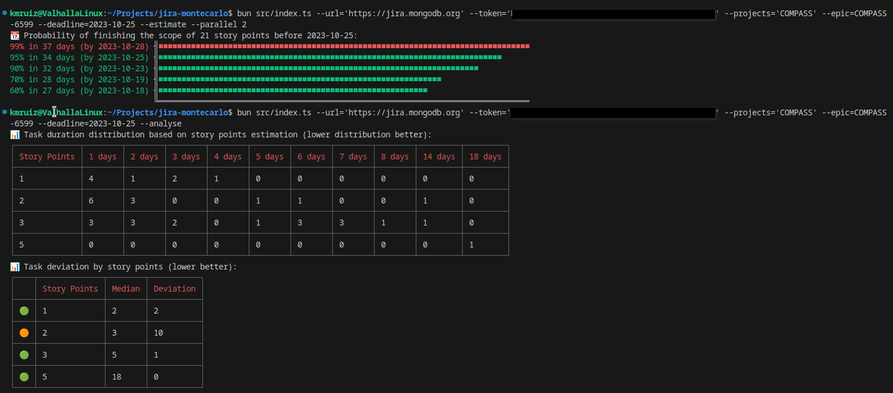

# jira-montecarlo

Playground to implement the Montecarlo simulation for a JIRA backlog. I've just
implemented this to play a bit with bun and it works only for our setup at MongoDB.
However, feel free to modify and adapt to your needs.

Right now it can:

* Simulate when the team will finish a specific epic or milestone.
* Print the simulated scope.
* Analyse task's duration distribution given the initial estimation in story points.
* Analyse which tasks are outlier.

## How to start

Install the dependencies with bun:

```bash
bun install
```

Once it's done, run the help command:

```bash
bun run src/index.ts --help
```

## Releasing

You can generate a binary for your platform using bun:

```bash
bun run release
```

## How it looks like

